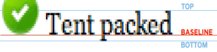

# 文字的看重标记与段落的层次划分
## 加粗、斜体
**tab/enter换行键/空格键**
## 高亮、删除
## 多级标题
## 分割线
## 段落引用
## 列表
tab shift-tab
无序*/-/+
有序以1开头的数组.
# 特定功能的实现与复杂用法的折腾
## 图片

## 表格
| Syntax | Description |
| ------ | ----------- |
|        |             |
|        |             |
|        |             |

### 表格中|怎么输入
用 &#124; 或者 &#x7C; 来代替
## 代码
```
font-size: 14px
```
## 生成目录
右键-命令面板-搜toc
## 超链接
## 脚注
## 图床与图表