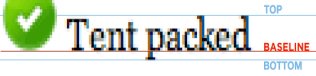

- [CSS权重](#css权重)
  - [0继承/\*/\>/+相邻选择器/~同胞选择器;](#0继承相邻选择器同胞选择器)
  - [1标签选择器/伪元素选择器;](#1标签选择器伪元素选择器)
  - [10类选择器/伪类选择器/属性选择器;](#10类选择器伪类选择器属性选择器)
    - [结构伪类选择器](#结构伪类选择器)
    - [链接伪类选择器（确保生效LVHA）所有标签都可用](#链接伪类选择器确保生效lvha所有标签都可用)
  - [100ID选择器;](#100id选择器)
  - [1000内联样式](#1000内联样式)
  - [无穷](#无穷)
  - [叠加计算](#叠加计算)
- [行内标签（也叫内联标签）的padding/margin](#行内标签也叫内联标签的paddingmargin)
- [盒子模型(所有HTML标签都有)](#盒子模型所有html标签都有)
- [水平居中](#水平居中)
- [垂直居中](#垂直居中)
- [固定定位在版心一侧算法](#固定定位在版心一侧算法)
- [清除浮动四种方法](#清除浮动四种方法)
  - [给需要清除浮动的元素添加/调用](#给需要清除浮动的元素添加调用)
  - [浮动元素与非浮动元素之间添加空的应用清除浮动的盒子：](#浮动元素与非浮动元素之间添加空的应用清除浮动的盒子)
  - [父标签结尾添加空块标签，块标签应用清除浮动](#父标签结尾添加空块标签块标签应用清除浮动)
  - [父级标签样式触发BFC](#父级标签样式触发bfc)
  - [为标准流父元素添加高度，使其不塌陷](#为标准流父元素添加高度使其不塌陷)
- [盒子模型设置](#盒子模型设置)
- [Icon的使用](#icon的使用)
- [如何让div中的ul水平居中（li默认浮动）](#如何让div中的ul水平居中li默认浮动)
- [塌陷的2种（根本原因2个盒子之间的外边距是公共的）](#塌陷的2种根本原因2个盒子之间的外边距是公共的)
- [实现三角](#实现三角)
- [浏览器私有前缀兼容写法(为了提前使用新属性)：](#浏览器私有前缀兼容写法为了提前使用新属性)
- [搜索引擎优化SDK](#搜索引擎优化sdk)
  - [Loge的SEO](#loge的seo)
  - [TDK的SEO](#tdk的seo)
- [BFC](#bfc)
- [解决图片元素基线对齐](#解决图片元素基线对齐)
- [a和span等行内元素无法嵌套图片](#a和span等行内元素无法嵌套图片)
- [移动端body的CSS](#移动端body的css)
- [固定定位盒子移动端水平居中的方法](#固定定位盒子移动端水平居中的方法)
- [快捷写法](#快捷写法)
- [函数公式（从哪个开始n就是几）n必须写在前面](#函数公式从哪个开始n就是几n必须写在前面)
- [好习惯](#好习惯)
- [趴网站的icon图](#趴网站的icon图)
- [Less使用（HTML写法）](#less使用html写法)
  - [rem的复用计算](#rem的复用计算)
  - [链接伪类选择器：](#链接伪类选择器)
- [精灵图](#精灵图)
- [Commit message](#commit-message)
- [baseline](#baseline)
- [命名方法](#命名方法)
- [段落显示n行](#段落显示n行)
- [单位](#单位)
  - [rem使用](#rem使用)
  - [单位成立](#单位成立)
  - [less复用](#less复用)
  - [rem移动端布局](#rem移动端布局)
- [媒体查询](#媒体查询)
- [移动端顶部搜索框实现方法](#移动端顶部搜索框实现方法)
- [行内元素产生间隙的键盘按键](#行内元素产生间隙的键盘按键)
- [CSS中引入CSS(引入common.css)](#css中引入css引入commoncss)

# CSS权重
## 0继承/*/>/+相邻选择器/~同胞选择器;
## 1标签选择器/伪元素选择器;
| Syntax       | Description                 |
| ------------ | --------------------------- |
| ::before     | 伪元素选择器                |
| ::after      | css中创建父盒子里面行内元素 |
| content: ""; | 必须具有                    |
伪元素的因果写法
```
.dropdown .dd ul li:hover a {
    color: #c81623;
}
```
## 10类选择器/伪类选择器/属性选择器;
| 类选择器 | Description |
| -------- | ----------- |
| .-class= |             |

| 属性选择器              | Description                                |
| ----------------------- | ------------------------------------------ |
| .-class=                |                                            |
| [disabled]              | 选择具有name属性                           |
| [type="search"]         | 选择具有input属性且属性值等于text的        |
| [class ~= 'nihao']      | 选择类中有nihao的，nihao与其他类用空格隔开 |
| div[class&#124;="icon"] | 以icon或icon-开头的元素                    |
| div[class^="icon"]      | 匹配具有att属性且值以val开头的E元素        |
| div[class$="icon"]      | 匹配具有att属性且值以val结尾的E元素        |
| div[class*="icon"]      | 匹配具有att属性且值中含有val的E元素        |
### 结构伪类选择器
| 结构伪类选择器                   | Description    |
| -------------------------------- | -------------- |
| ul li:nth-child(n even/odd kx+b) | 先找孩子再匹配 |
| ul li:first-child                |                |
| ul li:last-child                 |                |
| :not(:last-child)                |                |
| ul li:nth-type(n even/odd kx+b)  | 先匹配再找孩子 |
| ul li:first-type                 |                |
| ul li:last-type                  |                |
type选的是标签，如果定义的class也选定义这个class对应的标签
### 链接伪类选择器（确保生效LVHA）所有标签都可用
```
a:link {  
color:#333;  
text-decoration:none;  
}  
a:visited {  
color:#333;  
text-decoration:none;  
}  
a:hover {  
color:#333;  
text-decoration:none;  
}  
a:active {  
color:#333;  
text-decoration:none;  
}
```
```
:focus聚焦伪类选择器
```
## 100ID选择器;
```
#-id=
```
## 1000内联样式
```
<p style="color: pink; font-size: 20px;">;
```
## 无穷
```
!important；
```
## 叠加计算
.nav li a{}
强调亲儿子：.nav>p>a{}子选择器为0
# 行内标签（也叫内联标签）的padding/margin
padding左右设置有效（auto是特殊贴边），上下设置有效，显示无效
margin左右设置有效（auto是特殊贴边），上下设置无效，显示无效
# 盒子模型(所有HTML标签都有)
```
content-box:content;padding;border;margin
```
同时设置背景图和背景色时，背景图将在背景色的上方显示
标准盒模型:width/height不包含padding/border
IE盒模型:width/height包含padding/border
IE盒模型设置:
```
box-sizing: border-box
```
标准盒模型设置:
```
box-sizing: content-box
```
# 水平居中
行内块元素/行内元素(块元素无效)相对它的块父元素水平居中：
```
text-align: center;
```
块元素的水平居中：
```
margin:0px auto;元素本身需要设置宽度
```
绝对定位水平居中：
```
position:absolute;left:50%;margin-right:-xxpx/
```
# 垂直居中
行内块元素/行内元素(块元素无效)相对它的块父元素垂直居中:
```
height: 400px;
line-height: 400px;
```
（content盒）/vertical-align: middle/top/bottom;
块元素（自身相对外界）垂直居中:
```
margin:auto 0px;父元素/元素本身必须设置高度
```
父元素（无论父元素是盒子还是浏览器本身）有高度代码
```
position: absolute;
left: 0;
right: 0;
top: 0;
bottom: 0;
```
绝对定位垂直居中：
```
position:absolute;top:50%;margin-top:-xxpx/transform：translate(-50%, -50%);
.children {
  position: absolute;
  top: calc(50% - 100px);
  left: calc(50% - 100px);
}（定位上、左负50%时减去子元素宽、高）
```
# 固定定位在版心一侧算法
```
position:fixed;
left:50%;
margin-left:xxpx
```
# 清除浮动四种方法
## 给需要清除浮动的元素添加/调用
```
class="clear";
.clear{clear: left/right/both;}
```
## 浮动元素与非浮动元素之间添加空的应用清除浮动的盒子：
```
.clear-div{
    clear:both;
}
```
## 父标签结尾添加空块标签，块标签应用清除浮动
```
.clearfix:after {
    content: '';
    height: 0;
    display: block;
    clear: both;
}
.father-box{
    *zoom: 1;
}
.clearfix:before,
.clearfix:after{
     content:'';
     display:table;
}
.clearfix:after{
     clear:both;
}
.father-box{
    *zoom: 1;
}
```
## 父级标签样式触发BFC
添加:
{overflow:auto}
## 为标准流父元素添加高度，使其不塌陷
height="xxpx";
# 盒子模型设置
全文固定
```
*{
box-sizing:border-box;
}
```
默认IE盒子，特殊地方可特殊设置
```
html{
box-sizing:border-box;
}
*,
*::before,
*::after{
box-sizing:inherit;
}
```
# Icon的使用
# 如何让div中的ul水平居中（li默认浮动）
父盒子div设置：text-align: center;
ul设置：display: inline-block;
# 塌陷的2种（根本原因2个盒子之间的外边距是公共的）
同级盒子边距重合
子盒子带父盒子塌陷
# 实现三角
实心三角：
```
div {
    border: 10px;
    border-color: red transparent transparent transparent;
}
```
箭头三角：
```
div {
    width: 10px;
    height: 10px;
    border-right: 1px solid #000;
    border-bottom: 1px solid #000;
    transform: rotate(45deg);
}
```
# 浏览器私有前缀兼容写法(为了提前使用新属性)：
| Syntax                      | Description         |
| --------------------------- | ------------------- |
| border-radius:10px;         | 默认                |
| -moz-border-radius:10px;    | Firefox浏览器       |
| -webkit-border-radius:10px; | Safair/Chrome浏览器 |
| -o-border-radius:10px;      | Opera浏览器         |
# 搜索引擎优化SDK
## Loge的SEO
## TDK的SEO
```
<title>京东(JD.COM)-正品低价、品质保障、配送及时、轻松购物！</title>
<meta name="description" content="京东JD.COM-专业的综合网上购物商城，为您提供正品低价的购物选择、优质便捷的服务体验。商品来自全球数十万品牌商家，囊括家电、手机、电脑、服装、居家、母婴、美妆、个护、食品、生鲜等丰富品类，满足各种购物需求。"/>
<meta name="Keywords" content="网上购物,网上商城,家电,手机,电脑,服装,居家,母婴,美妆,个护,食品,生鲜,京东"/>
```
# BFC
BFC是一个独立的布局环境，
1.BFC内部的元素布局与外部互不影响:不会与浮动元素重叠;不会与其他非BFC的边距重叠/塌陷
2.计算BFC的高度时，浮动子元素也参与计算，
# 解决图片元素基线对齐
```
img{
    vertical-align: middle;
    display: block/inline-block;
    line-height:0;
    font-size:0;
}
```
# a和span等行内元素无法嵌套图片
```
a变块级或者a的父亲变弹性盒
a{
  display: block/inline-block/flex;
  img{
    width=100%
  }
}
```
```
div{
  display: flex;
  a{
    img{}
  }
}
```
# 移动端body的CSS
```
body {
    color: #000;
    overflow-x: hidden;
    -webkit-tap-highlight-color: rgba(0,0,0,0);    
    -webkit-text-size-adjust: none;
    -moz-user-select: none;
    min-width: 340px；
    max-width: 1080px;
    margin: 0 auto;
    font-family: normal 14px/1.5 -apple-system, Helvetica, sans-serif;
    background: #f4f4f4;
}
```
# 固定定位盒子移动端水平居中的方法
固定定位宽度以屏幕为准
```
.search-index {
    display: flex;
    固定定位水平居中算法
    position: fixed;
    top: 0;
    left: 50%;
    /* 兼容性写法 */
    -webkit-transform: translateX(-50%);
    transform: translateX(-50%);
    移动端以屏幕为准
    width: 100%;
    min-width: 320px;
    max-width: 540px;
    height: 44px;
    background-color: #F6F6F6;
    border-top: 1px solid #ccc;
    border-bottom: 1px solid #ccc;
}
```
# 快捷写法
建立类名为xiao的div盒子
```
.xiao
```
2个
```
+
```
类名为xiao的ul盒子
```
ul.xiao
```
# 函数公式（从哪个开始n就是几）n必须写在前面
前n个
```
:nth-child(-n+9){}
```
后n个
```
:nth-child(n+6){}
```
限定某个范围
```
:nth-child(-n+9):nth-child(n+6){}
```
# 好习惯
盒子添加背景色
内容写数字行内1，2块123
# 趴网站的icon图
```
https://www.ctrip.com/favicon.ico
```
# Less使用（HTML写法）
## rem的复用计算
```
@font14: 14px;
a {
    font-size: @font14;
}
```
## 链接伪类选择器：
```
a {
     &::before {
     content: "";
  }
}
```
# 精灵图
通过background的负值实现移动到框外
```
background: url(../images/sprite.png) no-repeat -59px -279px;
background-size: 104px;
```
# Commit message
<type:feat/fix/docs/style/refactor/perf/test/revert/chore>(jd_m.html):<deletejd_m.html>
footer:issue
# baseline

# 命名方法
驼峰命名法（大写断开）
下划线命名法（下划线断开）一般用于前端命名
中划线断开，一般用于图片命名
# 段落显示n行
一行显示
```
white-space: nowrap;
overflow: hidden;
text-overflow: ellipsis;
```
多行显示
```
display: -webkit-box;
-webkit-box-orient: vertical;
-webkit-line-clamp: 3;
overflow: hidden;
```
# 单位
| Syntax          | Description                 |
| --------------- | --------------------------- |
| px              | 相对于父元素/HTML的字体大小 |
| em/rem          |                             |
| vw/vh/vmin/vmax |                             |
## rem使用
## 单位成立
```
html {
font-size: 50px;划分份数决定
}
```
## less复用
```
@baseFont: 50;
```
## rem移动端布局
```
html {
    font-size: 50px;
}
@no: 15;
@media screen and (min-width: 320px) {
    html {
        font-size: 320px / @no;
    }
}
// 360
@media screen and (min-width: 360px) {
    html {
        font-size: 360px / @no;
    }
}
@media screen and (min-width: 375px) {
    html {
        font-size: 375px / @no;
    }
}
```
# 媒体查询
针对于不同的屏幕尺寸 调用不同的css文件
```
<link rel="stylesheet" href="style320.css" media="screen and (min-width: 320px)">
<link rel="stylesheet" href="style640.css" media="screen and (min-width: 640px)">
```
# 移动端顶部搜索框实现方法
# 行内元素产生间隙的键盘按键
**tab/enter换行键/空格键**
解决方法：
父元素设置
```
font-size:0
```
子元素设置
```
font-size：14px（防止继承）
```
# CSS中引入CSS(引入common.css)
```
@import "common";
```